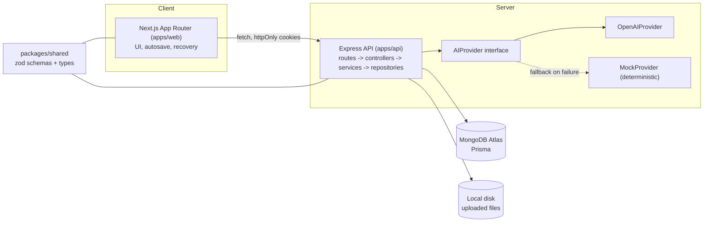
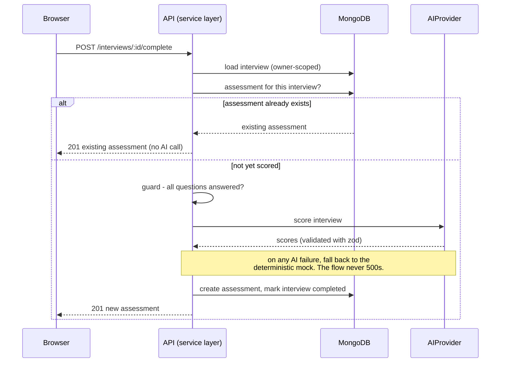
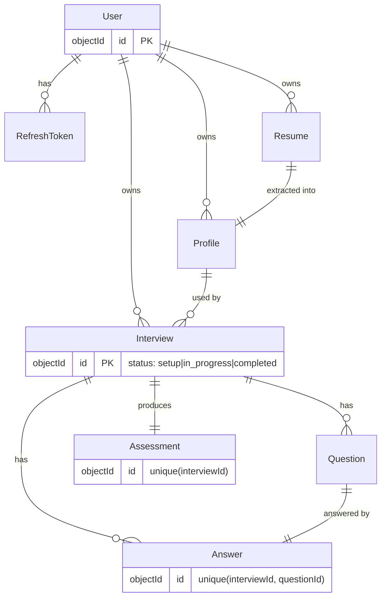

# Interview IQ

AI interview practice and assessment. A candidate uploads a resume, reviews an extracted profile, runs a five question personalised mock interview, and receives a scored assessment with strengths, improvement areas, and one improved answer example. Completed assessments are saved to a history screen.

Built with TypeScript end to end: a Next.js frontend, an Express backend, MongoDB via Prisma, and a swappable AI layer (OpenAI with a deterministic mock fallback).

> Stack: TypeScript, Next.js (App Router), Express, Prisma, MongoDB (Atlas), OpenAI. Monorepo via pnpm and Turborepo.

## Table of contents

- [What it does](#what-it-does)
- [Architecture](#architecture)
- [Critical flow: idempotent completion](#critical-flow-idempotent-completion)
- [Data model](#data-model)
- [Key decisions and trade-offs](#key-decisions-and-trade-offs)
- [API](#api)
- [Reliability and security](#reliability-and-security)
- [Getting started](#getting-started)
- [Environment](#environment)
- [Testing](#testing)
- [Deployment](#deployment)
- [Accessibility and design](#accessibility-and-design)
- [Future improvements](#future-improvements)

## What it does

```
Upload resume  ->  Review profile  ->  Interview setup  ->  Practice session  ->  Assessment  ->  History
```

1. Upload a PDF or DOCX resume. The server validates type and size, extracts text, and derives a candidate profile (skills, experience, summary).
2. Review and edit that profile, then choose a target role, seniority, and an optional job description.
3. Answer five personalised questions one at a time. Answers autosave, and an interrupted session resumes after a refresh or a fresh login. Voice input is available where the browser supports it.
4. Complete the interview to get an overall score, four category scores, strengths, improvement areas, and one improved answer example. Everything persists to a history screen.

## Architecture

The browser never talks to the database. Every request flows through the Express API, which owns authentication, validation, and access control. This single trust boundary is the core architectural decision and it drives most of the others below.



Backend layering is strictly one direction. No layer skips or reverses.

```
routes        map HTTP to controllers
controllers   validate input, shape the response envelope
services      domain logic, enforce ownership, orchestrate adapters
repositories  the only place that touches Prisma
adapters      isolate the outside world: ai/, file/, storage/
```

Shared zod schemas and types live in `packages/shared` and are imported by both apps, so the API contract cannot drift between client and server. The same schema that validates a request body also types the form on the frontend, and the same schema that shapes an assessment also validates the AI provider output.

### Repository layout

```
interview-iq/
  apps/
    web/                Next.js App Router
      app/(app)/        upload, profile, interview, assessment, history
      components/       ui primitives, score visuals, states
      lib/              api client, auth context, hooks
    api/
      src/
        routes/         HTTP to controller
        controllers/    parse and respond
        services/       domain logic, ownership
        repositories/   Prisma queries
        adapters/       ai (interface + OpenAI + Mock), file (pdf/docx), storage
        middleware/     auth, rate limit, error, request id, upload
        config/         env validation
      prisma/           schema, seed
      tests/            vitest + supertest
  packages/
    shared/             zod schemas and types shared by both apps
```

## Critical flow: idempotent completion

Completing an interview is the most failure sensitive path: it calls the AI provider, writes an assessment, and must never double charge, double write, or 500 the user. It is idempotent by design.



Answer saving follows the same principle: it upserts on `(interviewId, questionId)`, so a refresh, a retry, or a double click can never create a duplicate answer.

## Data model



Each collection uses an ObjectId primary key and stored timestamps. Fields used to join or filter are indexed. Unique indexes enforce idempotency at the database layer, not just in code (for example a single answer per interview and question, and a single assessment per interview).

## Key decisions and trade-offs

| Decision | Why | Trade-off accepted |
| --- | --- | --- |
| Access control in the service layer | The browser never touches the database. The API is the only client and enforces ownership on every query. MongoDB has no row level access control, so this is where it belongs. | Repository queries must always filter by owner. Enforced consistently and covered by a test. |
| MongoDB Atlas now, dedicated later | A managed cluster to start. Moving to a larger Atlas tier or a self hosted MongoDB is a connection string change, no code change. | Atlas free tier (M0) is a shared cluster; fine for a demo. |
| Custom JWT with refresh rotation | Full control of the auth model, short lived access token plus a rotating refresh token whose hash only is stored. | More code than a hosted auth provider, but no third party dependency and a clear security story. |
| AI behind one interface, mock fallback | The product is graded on engineering, not on a paid AI account. Any provider failure falls back to a deterministic mock, so the flow never fails. | The mock is heuristic, not intelligent; it exists for resilience and reproducible tests, not quality. |
| Monorepo with a shared package | One source of truth for zod schemas and types. The API contract cannot drift between client and server. | Slightly more build wiring (Turborepo handles ordering). |
| React Context and hooks, not Redux | Client state is small: the authenticated user plus per screen data. Context plus local state fits the scope. | No global cache; each screen fetches its own data. TanStack Query would be the next step if caching mattered. |
| `prisma db push` for schema sync | Prisma uses `db push` for MongoDB; the SQL style `migrate dev` workflow does not apply to a document database. | Index and shape changes are applied directly; there is no SQL migration history. |
| Next.js 15 and React 19 | Current stable. Next 14 hit a static generation bug on the internal error pages. | Latest majors, kept current on purpose. |

## API

| Method | Path | Purpose |
| --- | --- | --- |
| POST | /api/auth/register | Create an account |
| POST | /api/auth/login | Sign in |
| POST | /api/auth/refresh | Rotate tokens |
| POST | /api/auth/logout | Revoke sessions |
| GET | /api/auth/me | Current user |
| POST | /api/resumes | Upload and process a resume |
| GET | /api/profiles/:id | Get a profile |
| PATCH | /api/profiles/:id | Save profile edits |
| POST | /api/interviews | Create a personalised interview |
| GET | /api/interviews/:id | Load or resume an interview |
| POST | /api/interviews/:id/answers | Save an answer (idempotent) |
| POST | /api/interviews/:id/complete | Complete and score (idempotent) |
| GET | /api/interviews/history | List past interviews |
| GET | /api/assessments/:id | Retrieve an assessment |
| GET | /api/health/live | Liveness |
| GET | /api/health/ready | Readiness (checks the database) |

Every response uses one envelope: `{ success, data?, error?, requestId }`. Errors carry a stable `code` and a human readable `message`.

## Reliability and security

- Idempotency: answers upsert on `(interviewId, questionId)`; completion returns the existing assessment if present.
- Fallback: AI failures fall back to the deterministic mock. The user flow never returns a 500 from the AI layer.
- Validation: zod on every input and on all AI output, which is repaired or rejected before it is trusted.
- Files: MIME and extension checks, a size cap, in memory buffering, and local disk storage outside any public webroot. The extracted resume text is stored in the database, so the raw file blob is not read back by any flow.
- Auth: bcrypt password hashing, short lived access token in an httpOnly cookie, rotating refresh token stored only as a SHA-256 hash.
- Rate limiting on auth and on the expensive upload and scoring endpoints.
- Structured logging with a request id on every request and redaction of secrets. Liveness and readiness endpoints, where readiness touches the database.
- Secrets are validated at startup and are server side only. Only `NEXT_PUBLIC_` values reach the browser.

## Getting started

Prerequisites: Node 20 or newer, pnpm 9, and a MongoDB database (a free MongoDB Atlas cluster works).

```bash
# 1. Install
pnpm install

# 2. Configure the API
cp .env.example apps/api/.env
# Fill DATABASE_URL with your MongoDB connection string.
# Leave AI_PROVIDER=mock to run with no OpenAI key. Uploads go to local disk.

# 3. Configure the web app
echo "NEXT_PUBLIC_API_URL=http://localhost:4000" > apps/web/.env.local

# 4. Sync the schema (indexes) and seed demo data
pnpm db:push
pnpm db:seed

# 5. Run both apps
pnpm dev
```

Open http://localhost:3000.

### Demo mode

`pnpm db:seed` creates a demo account with a completed interview and assessment, so the full journey and the history screen have data immediately.

```
Email:    demo@interviewiq.app
Password: Demo1234!
```

Set `AI_PROVIDER=mock` (the default) to run the entire flow offline with deterministic output and no external key. Set `AI_PROVIDER=openai` with an `OPENAI_API_KEY` to use the real provider; it falls back to the mock on any failure.

## Environment

See [.env.example](.env.example) for the full annotated list. Summary:

- Database: `DATABASE_URL`, the MongoDB connection string (include a database name, for example `.../interview_iq?...`).
- Storage: `LOCAL_STORAGE_DIR` for uploaded files on local disk.
- Auth: `JWT_ACCESS_SECRET`, `JWT_REFRESH_SECRET`, and their expiry values.
- AI: `AI_PROVIDER`, `OPENAI_API_KEY`, `OPENAI_MODEL`.
- Limits: `MAX_FILE_SIZE_MB`, `RATE_LIMIT_WINDOW_MS`, `RATE_LIMIT_MAX`.
- Web: `NEXT_PUBLIC_API_URL`.

Note for MongoDB Atlas: under Network Access, allow `0.0.0.0/0` so a cloud host can connect, and URL encode any special characters in the database user password.

## Testing

```bash
pnpm test
```

- Backend: the critical flow is covered, including answer idempotency and the complete to assessment path (which returns the existing assessment on a repeat call), plus deterministic mock provider output and JWT round trips.
- Frontend: a Testing Library interaction test for the primary action component.

The suite runs without a live database or an AI key, because the critical service logic is tested against mocked repositories and the deterministic provider.

## Deployment

Free tier friendly split:

- Frontend on Vercel (Next.js).
- Backend on Render as a web service (Node).
- Database on MongoDB Atlas.

Because the web app and API sit on different domains, prefer proxying `/api` from the web host to the backend so authentication cookies stay first party. Set `CORS_ORIGIN` on the API to the web origin, and provide the environment variables listed above on the backend host. See [DEPLOYMENT.md](DEPLOYMENT.md) for the full step by step guide.

## Accessibility and design

- Semantic HTML, labelled inputs, a visible focus ring, a skip link, and full keyboard reachability across the flow.
- Contrast targeted at WCAG AA or better, in both light and dark themes.
- A deliberate palette (teal primary, amber accent, zinc neutrals) rather than a generic gradient. Geist Sans for UI and Geist Mono for numeric scores. Icons via lucide-react.
- Motion is limited to transform and opacity and respects reduced motion preferences.

## Future improvements

- Voice answers everywhere with a hosted speech to text service, beyond the browser only Web Speech API.
- Move rate limiting and refresh token storage to Redis for multi instance deployments.
- Streamed AI responses for faster perceived question generation.
- Committed Prisma migrations and a CI pipeline that runs typecheck, tests, and a preview deploy.
- Richer resume parsing (sections and dates) and a confidence hint on extracted fields.
